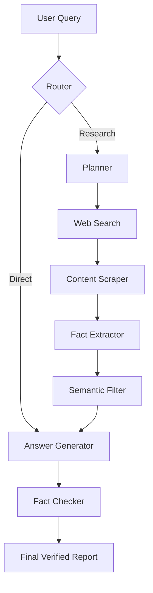

# 🚀 NextQuestAI: Deep Research Multi-Agent System


NextQuestAI is a high-performance, multi-agent research orchestrator powered by **LangGraph** and **NVIDIA NIM**. It transforms simple queries into comprehensive, verified research reports by coordinating specialized agents for planning, searching, scraping, and fact-verification.


---

## 🌟 Key Features

*   **Intelligent Routing**: Automatically determines if a query needs live web research or can be answered directly.
*   **Semantic Fact Ranking**: Filters through massive amounts of scraped data to extract only the highest-quality, most relevant facts.
*   **Agentic Self-Correction**: A dedicated Verifier agent cross-checks every claim against source data to eliminate hallucinations.
*   **Multi-Provider Support**: Optimized for **NVIDIA NIM**, with fallbacks for HuggingFace, OpenRouter, and Gemini.
*   **Persistent Research History**: Powered by a local SQLite database, allowing you to resume research sessions at any time.

---

## 🛠️ Quick Start

### 1. Local Setup
```bash
# Clone the repository
git clone https://github.com/ajeetkbhardwaj/NextQuestAI.git
cd NextQuestAI

# Install dependencies
pip install -r requirements.txt

# Configure Environment
cp .env.example .env
# Edit .env and add your NVIDIA_API_KEY
```

---

## 🔑 API Key Management (BYOK)

NextQuestAI supports **Bring Your Own Key (BYOK)**. 
- **System Default**: If deployed on Hugging Face, the app uses a pre-configured NVIDIA key for convenience.
- **Privacy First**: If you enter your own API key in the sidebar, it will override the system default and be used exclusively for your session. Your key is never stored and remains private to your browser session.

---

### 2. Run the Application
```bash
streamlit run app.py
```

---

## ☁️ Deploy to Hugging Face Spaces

NextQuestAI is optimized for deployment on Hugging Face Spaces using the **Streamlit SDK** or **Docker SDK**.

### Steps to Deploy:
1.  **Create a Space**: Use the "Streamlit" SDK.
2.  **Add Secrets**: In your Space Settings, add the following secrets:
    *   `NVIDIA_API_KEY`: Your Nvidia NIM API key.
    *   `SEARCH_PROVIDER`: `duckduckgo` (default).
3.  **Push Code**: Connect your GitHub repository via the `huggingface_sync.yml` workflow.

### Environment Variable Priority:
The app handles API keys in the following order:
1.  **UI Input**: Manual entry in the Streamlit sidebar (Highest priority).
2.  **Environment Variables**: Secrets set in Hugging Face or `.env` files.

---

## 🏗️ Architecture



---

## 📄 License
This project is licensed under the MIT License - see the [LICENSE](LICENSE) file for details.
