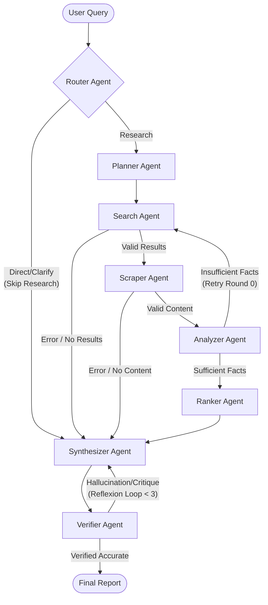

<style>
@import url('https://fonts.googleapis.com/css2?family=Noto+Sans+JP:wght@400;500;700&family=Fira+Code:wght@400;500;700&display=swap');

:root {
  --color-foreground: #ffffff;
  --color-heading: #ffffff;
  --color-accent: #00e5ff;
  --color-accent2: #7000ff;
  --color-box-bg: rgba(255,255,255,0.08);
  --font-default: 'Noto Sans JP', sans-serif;
  --font-code: 'Fira Code', monospace;
}

section {
  background: linear-gradient(135deg, #0a0a1a 0%, #1a1a2e 50%, #16213e 100%);
  color: var(--color-foreground);
  font-family: var(--font-default);
  font-weight: 400;
  box-sizing: border-box;
  position: relative;
  line-height: 1.6;
  font-size: 20px;
  padding: 48px 56px;
}

section:nth-child(2n) {
  background: linear-gradient(135deg, #16213e 0%, #1a1a2e 50%, #0a0a1a 100%);
}

section:nth-child(3n) {
  background: linear-gradient(135deg, #0a0a1a 0%, #16213e 100%);
}

section:nth-child(4n) {
  background: linear-gradient(135deg, #00d2ff 0%, #3a7bd5 100%);
}

section:nth-child(5n) {
  background: linear-gradient(135deg, #6a11cb 0%, #2575fc 100%);
}

h1, h2, h3, h4, h5, h6 {
  font-weight: 700;
  color: var(--color-heading);
  margin: 0;
  padding: 0;
  text-shadow: 0 2px 10px rgba(0, 0, 0, 0.4);
}

h1 {
  font-size: 52px;
  line-height: 1.2;
}

h2 {
  font-size: 38px;
  padding-bottom: 8px;
  border-bottom: 2px solid rgba(0,229,255,0.4);
  margin-bottom: 24px;
}

h2::before {
  content: '⚡ ';
  color: var(--color-accent);
}

h3 {
  color: var(--color-accent);
  font-size: 26px;
  margin-top: 24px;
  margin-bottom: 12px;
}

ul, ol {
  padding-left: 28px;
}

li {
  margin-bottom: 6px;
}

li::marker {
  color: var(--color-accent);
}

strong {
  color: var(--color-accent);
  font-weight: 700;
}

code {
  background: rgba(255,255,255,0.12);
  padding: 2px 6px;
  border-radius: 4px;
  font-family: var(--font-code);
  font-size: 0.9em;
}

pre {
  background: rgba(0,0,0,0.5);
  border: 1px solid rgba(255,255,255,0.1);
  border-radius: 8px;
  padding: 16px 20px;
  font-family: var(--font-code);
  font-size: 14px;
  overflow-x: auto;
  line-height: 1.4;
}

pre code {
  background: transparent;
  padding: 0;
}

table {
  width: 100%;
  border-collapse: collapse;
  margin: 16px 0;
  font-size: 16px;
}

th, td {
  padding: 10px 14px;
  text-align: left;
  border-bottom: 1px solid rgba(255,255,255,0.1);
}

th {
  background: rgba(255,255,255,0.05);
  color: var(--color-accent);
  font-weight: 600;
}

tr:hover {
  background: rgba(255,255,255,0.03);
}

footer {
  font-size: 14px;
  color: rgba(255, 255, 255, 0.4);
  position: absolute;
  left: 56px;
  right: 56px;
  bottom: 24px;
  text-align: center;
}

section.lead {
  background: linear-gradient(135deg, #0f0c29 0%, #302b63 50%, #24243e 100%);
  display: flex;
  flex-direction: column;
  justify-content: center;
  align-items: center;
  text-align: center;
}

section.lead h1 {
  margin-bottom: 12px;
  text-align: center;
  font-size: 64px;
  background: -webkit-linear-gradient(#00e5ff, #7000ff);
  -webkit-background-clip: text;
  -webkit-text-fill-color: transparent;
}

section.lead p {
  font-size: 24px;
  color: var(--color-foreground);
  opacity: 0.9;
}

.box {
  background: var(--color-box-bg);
  border: 1px solid rgba(0,229,255,0.2);
  border-radius: 12px;
  padding: 18px 24px;
  margin: 12px 0;
}

.box-grid {
  display: grid;
  grid-template-columns: repeat(2, 1fr);
  gap: 12px;
  margin: 12px 0;
}

.box-item {
  background: var(--color-box-bg);
  border: 1px solid rgba(255,255,255,0.1);
  border-radius: 8px;
  padding: 14px;
}

.box-item h4 {
  color: var(--color-accent);
  font-size: 18px;
  margin-bottom: 6px;
}

.flow {
  display: flex;
  align-items: center;
  justify-content: center;
  gap: 10px;
  margin: 16px 0;
  flex-wrap: wrap;
}

.flow-item {
  background: rgba(0,229,255,0.1);
  border: 1px solid var(--color-accent);
  border-radius: 6px;
  padding: 8px 16px;
  font-weight: 600;
  font-size: 16px;
}

.flow-arrow {
  color: var(--color-accent);
  font-size: 20px;
}

.icon-badge {
  display: inline-block;
  background: var(--color-accent);
  color: #0a0a1a;
  padding: 2px 10px;
  border-radius: 12px;
  font-size: 12px;
  font-weight: 700;
  margin-right: 6px;
  vertical-align: middle;
}
</style>

<!-- _class: lead -->

# NextQuestAI

## Deep Research Multi-Agent Framework

Intelligent Orchestration powered by NVIDIA NIM & LangGraph

Built with Streamlit • Tavily • HuggingFace Spaces

---

## Agenda

<div class="flow">
  <span class="flow-item">🏗️ Architecture</span>
  <span class="flow-arrow">→</span>
  <span class="flow-item">🤖 Multi-Agent</span>
  <span class="flow-arrow">→</span>
  <span class="flow-item">🔧 Tech Stack</span>
  <span class="flow-arrow">→</span>
  <span class="flow-item">🧩 Components</span>
  <span class="flow-arrow">→</span>
  <span class="flow-item">🚀 Deployment</span>
</div>

---

## What is NextQuestAI?

<div class="box">
<p><strong>Advanced Agentic Research Engine</strong> — A high-performance framework that transforms complex queries into comprehensive, fact-verified research reports using a swarm of specialized AI agents.</p>
</div>

<div class="box-grid">
  <div class="box-item">
    <h4>🚦 Intelligent Routing</h4>
    <p>Automatically detects if a query needs live research or a direct answer.</p>
  </div>
  <div class="box-item">
    <h4>🛡️ Fact Verification</h4>
    <p>Dedicated Verifier agent cross-checks every claim against source data.</p>
  </div>
  <div class="box-item">
    <h4>🔋 NVIDIA NIM Powered</h4>
    <p>Optimized for low-latency inference using NVIDIA's enterprise AI stack.</p>
  </div>
  <div class="box-item">
    <h4>📊 Semantic Ranking</h4>
    <p>Filters noise to extract only the highest-quality, most relevant facts.</p>
  </div>
</div>

---

## System Architecture

<h3>Multi-Agent Workflow</h3>



---

## The Research Pipeline

<h3>8 Specialized Agents in Coordination</h3>

<div class="box-grid">
  <div class="box-item">
    <h4>1️⃣ Router</h4>
    <p>Determines path: Direct Answer vs. Deep Research</p>
  </div>
  <div class="box-item">
    <h4>2️⃣ Planner</h4>
    <p>Decomposes query into a structured research plan</p>
  </div>
  <div class="box-item">
    <h4>3️⃣ Search & Scrape</h4>
    <p>Parallel web search and content extraction</p>
  </div>
  <div class="box-item">
    <h4>4️⃣ Ranker & Verifier</h4>
    <p>Filters facts by relevance and validates claims</p>
  </div>
</div>

<div class="box">
<p><span class="icon-badge">CORE</span>The <strong>Synthesizer</strong> assembles the final report with full source attribution and citations.</p>
</div>

---

## Technical Stack

| Component | Technology | Purpose |
|-----------|-----------|---------|
| **Orchestration** | <code>LangGraph 0.2+</code> | State-machine based multi-agent flow |
| **Inference** | <code>NVIDIA NIM</code> | High-performance LLM execution |
| **UI Framework** | <code>Streamlit 1.32+</code> | Interactive research dashboard |
| **Web Search** | <code>Tavily API</code> | AI-optimized search results |
| **Fact Ranking** | <code>Semantic Similarity</code> | High-precision data filtering |
| **Database** | <code>SQLite</code> | Persistent research history |
| **Observability** | <code>Custom Trace</code> | Real-time agent status tracking |
| **Deployment** | <code>HF Spaces</code> | Cloud-native hosting |

---

## LLM Providers: NVIDIA NIM Focus

<h3>Enterprise-Grade Inference</h3>

<div class="box">
<p>NextQuestAI is optimized for <strong>NVIDIA NIM</strong>, providing lightning-fast response times and support for cutting-edge models like Llama-3-70B and Nemotron.</p>
</div>

<div class="box-grid">
  <div class="box-item">
    <h4>🟢 Primary: NVIDIA NIM</h4>
    <p>Low-latency, high-throughput inference for core agents.</p>
  </div>
  <div class="box-item">
    <h4>🟡 Fallback: HuggingFace</h4>
    <p>Reliable secondary provider for lighter tasks.</p>
  </div>
  <div class="box-item">
    <h4>🔵 Flexible: OpenRouter</h4>
    <p>Access to any model (Claude, GPT, Gemini) via unified API.</p>
  </div>
</div>

---

## Intelligent Routing Logic

<h3>Direct vs. Research</h3>

<div class="box">
<p>The <strong>Router Agent</strong> analyzes the complexity and "freshness" requirements of a query to optimize resource usage.</p>
</div>

<div class="box-grid">
  <div class="box-item">
    <h4>🚀 Direct Path</h4>
    <p>Used for general knowledge or simple questions. Skips search/scrape to provide instant answers.</p>
  </div>
  <div class="box-item">
    <h4>🔍 Research Path</h4>
    <p>Used for complex, multi-faceted, or time-sensitive queries requiring live web data.</p>
  </div>
</div>

---

## Streamlit UI Design

<h3>Interactive Dashboard</h3>

```
┌──────────────────────────────────────────────────────────────┐
│  [ Sidebar: Settings, Model Select, API Key (BYOK) ]         │
│                                                              │
│  🚀 NextQuestAI Dashboard                                     │
│  ┌────────────────────────────────────────────────────────┐ │
│  │  🔍 Ask your research question...                       │ │
│  │  [ Generate Report ]                                    │ │
│  └────────────────────────────────────────────────────────┘ │
│                                                              │
│  [ Live Status: Agent 1 -> Agent 2 -> Agent 3... ]          │
│                                                              │
│  ┌────────────────────────────────────────────────────────┐ │
│  │                 RESEARCH REPORT                        │ │
│  │  ────────────────────────────────────────────────────  │ │
│  │  [ Markdown Content with Citations ]                   │ │
│  │                                                        │ │
│  │  📚 Sources: [Clickable Link List]                     │ │
│  └────────────────────────────────────────────────────────┘ │
└──────────────────────────────────────────────────────────────┘
```

---

## Key UI Features

<div class="box-grid">
  <div class="box-item">
    <h4>🔑 BYOK Support</h4>
    <p>Enter your own API keys for private, unlimited research.</p>
  </div>
  <div class="box-item">
    <h4>📜 History Sidebar</h4>
    <p>Access and resume previous research sessions instantly.</p>
  </div>
  <div class="box-item">
    <h4>📡 Live Status</h4>
    <p>Real-time visual feedback on which agent is currently working.</p>
  </div>
  <div class="box-item">
    <h4>🔗 Auto-Citations</h4>
    <p>Every claim is automatically linked to its verified web source.</p>
  </div>
</div>

---

## Deployment & Scalability

<h3>Cloud-Native Ready</h3>

<div class="box-item">
  <h4>1. HuggingFace Spaces</h4>
  <p>Optimized for Streamlit SDK. Zero-config deployment via <code>spaces.yaml</code>.</p>
</div>

<div class="box-item">
  <h4>2. Dockerized Environment</h4>
  <p>Self-host anywhere with the included <code>Dockerfile</code> and <code>docker-compose.yml</code>.</p>
</div>

<pre># Deployment Command
git push origin main  # Triggers auto-deploy to HF Space</pre>

---

## Project Structure

<pre>
NextQuestAI/
├── app.py              # Streamlit Entry Point
├── requirements.txt    # Framework dependencies
├── .env                # Environment configuration
├── src/
│   ├── agents.py       # Multi-agent definitions
│   ├── workflow.py     # LangGraph orchestration
│   ├── llm.py          # NVIDIA NIM & fallback clients
│   ├── search.py       # Tavily & DDG integration
│   ├── scraper.py      # Content extraction logic
│   ├── database.py     # SQLite history management
│   ├── observability.py # Real-time trace tracking
│   ├── performance.py   # Latency & token optimization
│   └── prompts.py      # Agent personas & instructions
└── tests/              # Validation suite
</pre>

---

## Performance & Optimization

<div class="box-grid">
  <div class="box-item">
    <h4>⚡ Parallel Processing</h4>
    <p>Multi-threaded scraping and search reduces latency by 50%.</p>
  </div>
  <div class="box-item">
    <h4>💾 Smart Caching</h4>
    <p>Redundant web requests are cached to save API credits and time.</p>
  </div>
  <div class="box-item">
    <h4>📉 Token Efficiency</h4>
    <p>Semantic filtering ensures agents only process relevant context.</p>
  </div>
  <div class="box-item">
    <h4>🔄 Self-Correction</h4>
    <p>Agents can loop back if verification fails, ensuring accuracy.</p>
  </div>
</div>

---

## Summary

<div class="box-grid">
  <div class="box-item">
    <h4>🎯 Purpose</h4>
    <p>Next-gen research orchestration for enterprise AI.</p>
  </div>
  <div class="box-item">
    <h4>🤖 Swarm Intelligence</h4>
    <p>8+ specialized agents working in harmony.</p>
  </div>
  <div class="box-item">
    <h4>🔋 High Performance</h4>
    <p>Built for NVIDIA NIM and real-time responsiveness.</p>
  </div>
  <div class="box-item">
    <h4>🚀 Production-Ready</h4>
    <p>Built-in observability, history, and verification.</p>
  </div>
</div>

---

<!-- _class: lead -->

# Thank You

## 🚀 NextQuestAI

**Empowering Intelligence through Agentic Research**

Questions? Feedback? Contributions?

🔗 https://github.com/ajeetkbhardwaj/NextQuestAI
